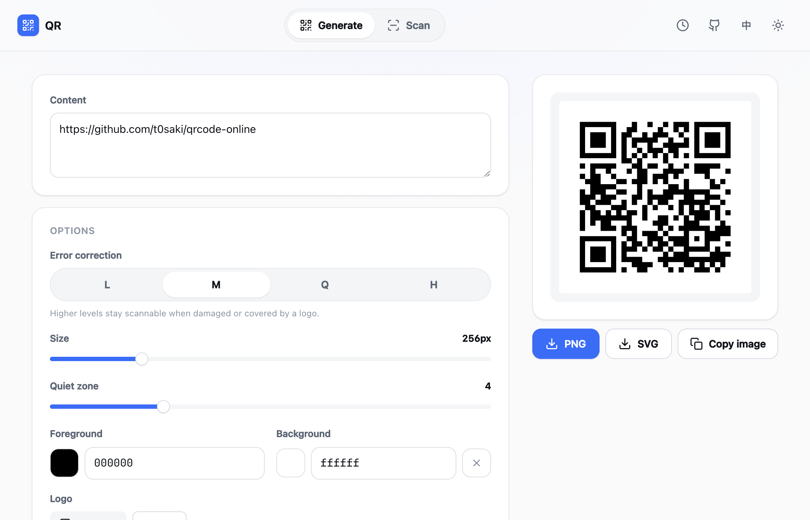
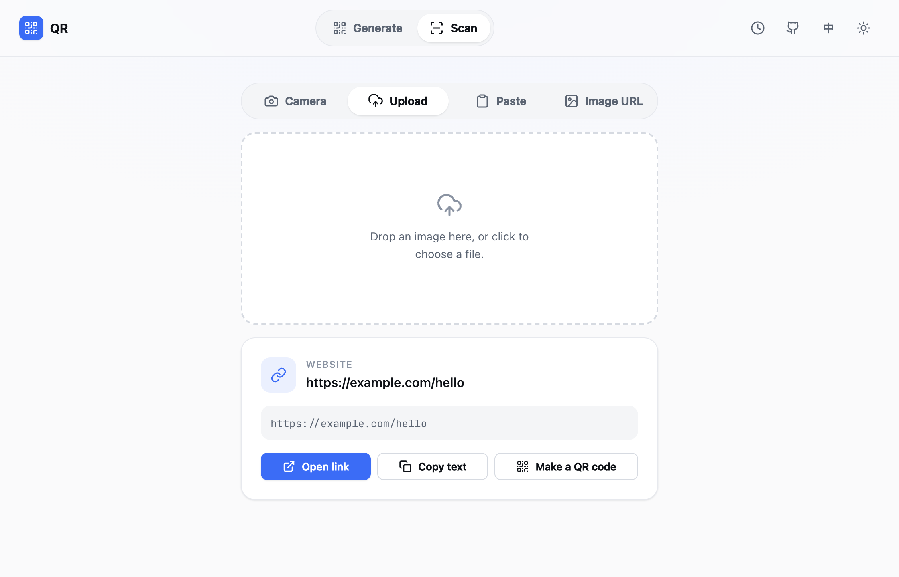
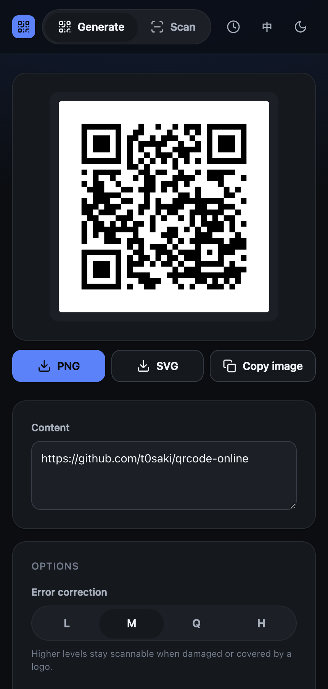

<div align="center">


# QR Code Online

**Generate & scan QR codes, beautifully — fast, private, and open source.**

A small, elegant QR toolkit that runs entirely in your browser and deploys to a single,
stateless [Cloudflare Worker](https://workers.cloudflare.com/). No tracking, no accounts,
no server-side storage. Plus a deterministic, cacheable **image API** you can drop straight
into an `` tag.

</div>

<p align="center">
  
</p>

## Features

- **Generate** — text or URL → live preview. Tune error-correction level, size, quiet zone,
  foreground/background colors (incl. transparent), and an optional center **logo**.
  Export **SVG** or **PNG**, copy the image, or copy an **embeddable link**.
- **Scan** from four sources — live **camera** (with torch & camera switch), **file upload**
  (drag & drop), **clipboard paste** (⌘/Ctrl+V), and a remote **image URL**.
- **Smart results** — decoded payloads are parsed into URLs, Wi-Fi, contacts (vCard/MeCard),
  locations, email, phone, SMS, and calendar events, each with one-tap actions
  (open, call, save `.vcf`/`.ics`, copy, “make a QR”).
- **Embeddable image API** — `GET /api/qr.png?data=…` returns a deterministic, year-cached QR.
- **Private by design** — all decoding happens in your browser; the Worker is stateless.
  Recent items are kept only in your browser's `localStorage`.
- **Installable PWA**, light/dark themes, and **中文 / English** (auto-detected).

<p align="center">
  
</p>

## The embeddable image API

Build a QR anywhere with a plain URL — perfect for emails, docs, dashboards, and READMEs:

```html

```

Two endpoints: **`/api/qr.svg`** and **`/api/qr.png`**.

| Param    | Type             | Default    | Range / values                         | Notes |
| -------- | ---------------- | ---------- | -------------------------------------- | ----- |
| `data`   | string (URL-enc) | — required | 1–2048 UTF-8 bytes                     | `400` if missing / too long / over capacity |
| `ecc`    | enum             | `M`        | `L` `M` `Q` `H`                        | error-correction level |
| `size`   | int (px)         | `256`      | 64–1024 (clamped)                      | rendered to the nearest crisp module scale |
| `margin` | int (modules)    | `4`        | 0–16 (clamped)                         | quiet zone |
| `dark`   | hex              | `000000`   | `rgb` or `rrggbb` (`#` optional)       | foreground |
| `light`  | hex / keyword    | `ffffff`   | hex, or `transparent`                  | background |

Responses are sent with `Cache-Control: public, max-age=31536000, immutable` + `ETag`
(and a permissive CORS header), so identical requests are served straight from Cloudflare's
edge cache. Errors return JSON: `{ "error": "<code>", "message": "…" }`.

```
# A 512px QR with a custom color and transparent background
/api/qr.png?data=https%3A%2F%2Fexample.com&size=512&ecc=Q&dark=3b6cf6&light=transparent

# Scalable SVG
/api/qr.svg?data=Hello%20world&margin=2
```

> There's also `GET /api/fetch-image?url=…` — an SSRF-guarded proxy used by the “Image URL”
> scanner to fetch a remote image past CORS (decoding still happens in your browser).

## Local development

```bash
pnpm install
pnpm dev        # Vite + the Workers runtime (workerd) at http://localhost:5173
pnpm build      # type-check + production build → dist/
pnpm typecheck  # client + worker type-checking
```

Requires Node ≥ 20 and [pnpm](https://pnpm.io). Camera scanning needs a secure origin
(`localhost` counts; in production it's HTTPS).

## Deploy to Cloudflare

[](https://deploy.workers.cloudflare.com/?url=https://github.com/t0saki/qrcode-online)

…or from your own clone (one-time `wrangler login` for your Cloudflare account):

```bash
wrangler login
pnpm deploy     # builds, then `wrangler deploy`
```

It fits comfortably on the **free** Workers plan — the Worker bundle is ~19 KB gzipped and
all QR decoding runs client-side.

## How it works

```
Browser (vanilla TS + Vite SPA)             Cloudflare Worker (one stateless script)
┌──────────────────────────────┐           ┌────────────────────────────────────┐
│ Generate: live <canvas>       │  shared/  │ GET /api/qr.svg · /api/qr.png        │  immutable-cached
│ Scan: BarcodeDetector,        │   qr  ──▶ │ GET /api/fetch-image?url= (proxy)    │  SSRF-guarded
│   lazy zxing-wasm fallback    │           │ else → static assets (SPA)           │
└──────────────────────────────┘           └────────────────────────────────────┘
```

A DOM-free `shared/qr` core (encoder → SVG/PNG renderers) runs in **both** the Worker and the
browser, so server PNGs and the live preview are pixel-identical. PNGs are hand-built with
`CompressionStream` (no canvas on the server). Scanning prefers the native `BarcodeDetector`
API and lazy-loads a self-hosted [`zxing-wasm`](https://github.com/Sec-ant/zxing-wasm) reader
only where it's missing (Safari/Firefox) — so Chromium ships **zero** WASM.

**Stack:** TypeScript · Vite · `@cloudflare/vite-plugin` · `@nuintun/qrcode` ·
`barcode-detector` (zxing-wasm) · `vite-plugin-pwa`. No UI framework; hand-crafted CSS.

<p align="center">
  
</p>

## Contributing

Issues and PRs welcome. Keep it small and tasteful — this project values a minimal,
dependency-light footprint.

## License

[MIT](LICENSE) © t0saki
